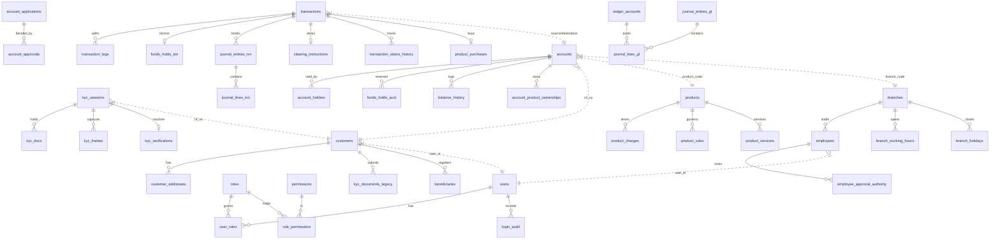

# 03 — Database Schema

Twelve MySQL schemas, one per business service. Every table below is created by a Flyway
migration under `services/<module>/src/main/resources/db/migration/` — that migration is
the source of truth, and this document is derived from it.

## The ownership rule

**A service writes only to its own schema.** There are no cross-database foreign keys. A
column that identifies a record owned by another service is a *logical reference*, validated
over HTTP, and is marked ⇢ below.

## Name collisions across schemas

Four table names exist in more than one schema with **different structures**. Getting these
confused is the single easiest mistake to make in this codebase.

| Table name | Schemas | Difference |
|---|---|---|
| `journal_entries`, `journal_lines` | `moneybags_transaction`, `moneybags_ledger` | Transaction's are `VARCHAR(36)` UUID keyed and scoped to one transaction; Ledger's are `BIGINT` auto-increment and are the actual general ledger |
| `funds_holds` | `moneybags_account`, `moneybags_transaction` | Account's is the authoritative hold on the balance; Transaction's mirrors it with the external hold id |
| `idempotency_records` | `moneybags_account`, `moneybags_transaction` | Same purpose, independent tables — account's stores `response_body`, transaction's stores `transaction_id` |
| `kyc_documents` | `moneybags_customer`, `moneybags_kyc` | Customer's is legacy metadata + file path; KYC's holds the actual binary in a `LONGBLOB` |

---

## `moneybags_identity` — identity-service

### `users`

| Column | Type | Notes |
|---|---|---|
| `user_id` | `BIGINT` PK auto | Seeded rows use 1–4; auto-increment starts at 2000 |
| `username` | `VARCHAR(80)` | UNIQUE |
| `email` | `VARCHAR(150)` | UNIQUE |
| `password_hash` | `VARCHAR(255)` | BCrypt |
| `full_name` | `VARCHAR(150)` | |
| `first_name` | `VARCHAR(100)` NULL | Added in V5 |
| `last_name` | `VARCHAR(100)` NULL | Added in V5 |
| `date_of_birth` | `DATE` NULL | Added in V5 |
| `gender` | `VARCHAR(20)` NULL | `MALE` `FEMALE` `OTHERS` |
| `mobile` | `VARCHAR(20)` NULL | |
| `status` | `VARCHAR(20)` | CHECK `ACTIVE` `LOCKED` `DISABLED` |
| `failed_attempts` | `INT` default 0 | Lockout counter |
| `employee_id` | `VARCHAR(64)` NULL | ⇢ branch-employee `employees.id`. Denormalised so the gateway resolves a session in one call |
| `branch_code` | `VARCHAR(20)` NULL | ⇢ branch-employee `branches.branch_code` |
| `last_login_at`, `password_changed_at`, `locked_until` | `DATETIME(6)` NULL | |
| `created_at`, `updated_at` | `DATETIME(6)` | |

### `roles`

`role_id` `BIGINT` PK auto · `role_name` `VARCHAR(50)` UNIQUE · `description` `VARCHAR(255)`

### `permissions`

`permission_id` `BIGINT` PK auto · `permission_code` `VARCHAR(60)` UNIQUE ·
`description` `VARCHAR(255)` · `service_name` `VARCHAR(60)` · `action` `VARCHAR(20)`

### `role_permissions`

Composite PK `(role_id, permission_id)`, both FK.

### `user_roles`

Composite PK `(user_id, role_id)`, both FK.

### `login_audit`

| Column | Type | Notes |
|---|---|---|
| `audit_id` | `BIGINT` PK auto | |
| `user_id` | `BIGINT` NULL | NULL when the username did not resolve |
| `username` | `VARCHAR(80)` | Always recorded, even for a failed attempt |
| `event_type` | `VARCHAR(30)` | |
| `event_time` | `DATETIME(6)` | |
| `ip_address` | `VARCHAR(45)` | IPv6-capable |
| `device_info` | `VARCHAR(255)` | User-Agent |
| `failure_reason` | `VARCHAR(255)` | |
| `outcome` | `VARCHAR(20)` | |

> `user_sessions` existed in V1 and was **dropped in V3** when authentication became
> stateless JWT. Do not build against it.

---

## `moneybags_customer` — customer-service

### `customers`

| Column | Type | Notes |
|---|---|---|
| `cif_no` | `VARCHAR(30)` **PK** | The customer's business key across the whole system |
| `user_id` | `BIGINT` NULL UNIQUE | ⇢ identity `users.user_id` |
| `relationship_manager_emp_id` | `BIGINT` NULL | ⇢ branch-employee `employees.id` |
| `first_name` | `VARCHAR(80)` | |
| `last_name` | `VARCHAR(80)` NULL | |
| `dob` | `DATE` | |
| `gender` | `VARCHAR(20)` | `MALE` `FEMALE` `NON_BINARY` `UNDISCLOSED` |
| `mobile` | `VARCHAR(20)` | |
| `email` | `VARCHAR(150)` NULL | |
| `pan_no` | `VARCHAR(10)` UNIQUE | |
| `status` | `VARCHAR(20)` | `ACTIVE` `INACTIVE` `DECEASED` `BLOCKED` |
| `kyc_status` | `VARCHAR(20)` | `PENDING` `VERIFIED` `REJECTED` `EXPIRED` — **canonical**, owned here |
| `risk_classification` | `VARCHAR(20)` default `LOW` | `LOW` `MEDIUM` `HIGH` |
| `preferred_communication_channel` | `VARCHAR(20)` default `EMAIL` | `EMAIL` `SMS` `PUSH` `NONE` |
| `email_notifications_enabled` | `BOOLEAN` default TRUE | Read by notification-service |
| `sms_notifications_enabled` | `BOOLEAN` default TRUE | |
| `push_notifications_enabled` | `BOOLEAN` default FALSE | |
| `kyc_failure_count` | `INT` default 0 | |
| `external_kyc_session_id` | `VARCHAR(36)` NULL | ⇢ kyc `kyc_sessions.id` (V3) |
| `external_kyc_decision` | `VARCHAR(20)` NULL | Makes KYC callbacks idempotent |
| `external_kyc_decided_at` | `DATETIME(6)` NULL | An older callback cannot overwrite a newer decision |
| `created_at`, `updated_at` | `DATETIME(6)` | |

### `customer_addresses`

`address_id` `BIGINT` PK auto · `cif_no` FK · `address_type` `VARCHAR(20)`
(`RESIDENTIAL` `PERMANENT` `OFFICE`) · `line1` `VARCHAR(150)` · `city` · `state` ·
`pincode` `VARCHAR(10)` · `country` · `is_current` `BOOLEAN` default TRUE

### `kyc_documents` *(legacy — see the collision table above)*

| Column | Type | Notes |
|---|---|---|
| `doc_id` | `BIGINT` PK auto | |
| `cif_no` | `VARCHAR(30)` FK | |
| `doc_type` | `VARCHAR(50)` | |
| `doc_number` | `VARCHAR(80)` | Never return unmasked to a client |
| `document_number_hash` | `VARCHAR(64)` | |
| `expiry_date` | `DATE` NULL | |
| `file_path` | `VARCHAR(500)` | Storage reference, not a public URL |
| `verify_status` | `VARCHAR(20)` | `PENDING` `VERIFIED` `REJECTED` |
| `assigned_to_emp_id`, `verified_by_emp_id` | `BIGINT` NULL | ⇢ branch-employee |
| `rejection_reason` | `VARCHAR(500)` NULL | |
| `submitted_at`, `verified_at`, `expiry_alerted_at` | `DATETIME(6)` | |

### `kyc_rejection_history`

`rejection_id` PK auto · `cif_no` · `doc_id` FK · `failure_reason` `VARCHAR(500)` ·
`rejected_by_emp_id` `BIGINT` · `attempt_number` `INT` · `rejected_at` `DATETIME(6)`

### `beneficiaries`

`beneficiary_id` PK auto · `cif_no` FK · `beneficiary_name` `VARCHAR(150)` ·
`beneficiary_account_no` `VARCHAR(30)` · `beneficiary_bank_name` ·
`beneficiary_ifsc` `VARCHAR(20)` · `beneficiary_nickname` · `beneficiary_type` ·
`status` · `added_at` · `activated_at`
UNIQUE `(cif_no, beneficiary_account_no, beneficiary_ifsc)`

> Beneficiaries are stored but **transaction-service no longer references them** — V2 of the
> transaction schema removed `beneficiary_id` from transfers. Transfers use account ids.

### `beneficiary_change_history`

`history_id` PK auto · `beneficiary_id` · `cif_no` · `change_type` `VARCHAR(40)` · `changed_at`

### `customer_domain_events`

Outbox. `event_id` PK auto · `aggregate_type` · `aggregate_id` · `event_type` ·
`payload` `TEXT` · `publication_status` (`PENDING` `PUBLISHED` `FAILED`) · `occurred_at` ·
`published_at` · `failure_reason`

---

## `moneybags_kyc` — kyc-service

Binary evidence lives here. All ids are `VARCHAR(36)` UUIDs.

### `kyc_sessions`

`id` PK · `cif_no` `VARCHAR(30)` ⇢ customer · `purpose` `VARCHAR(100)` ·
`document_type` `VARCHAR(30)` · `status` `VARCHAR(40)` · `created_at` · `updated_at`
INDEX `(cif_no, status, created_at)`

`status` values: `CREATED` `DOCUMENT_PENDING` `DOCUMENT_UPLOADED` `FRAME_CAPTURE_PENDING`
`FRAME_CAPTURED` `VERIFICATION_IN_PROGRESS` `VERIFIED` `REJECTED` `FAILED`

### `kyc_documents`

`id` PK · `session_id` FK · `document_type` `VARCHAR(30)` · `original_file_name` ·
`content_type` · `file_size` `BIGINT` · **`content` `LONGBLOB`** · timestamps
UNIQUE `(session_id, document_type)` — one document of each type per session

### `kyc_frames`

`id` PK · `session_id` FK · `frame_number` `INT` · `original_file_name` · `content_type` ·
**`content` `LONGBLOB`** · timestamps
UNIQUE `(session_id, frame_number)`

### `kyc_verifications`

`id` PK · `session_id` FK **UNIQUE** (zero-or-one per session) · `result` `VARCHAR(500)` ·
`reviewer_id` `VARCHAR(50)` ⇢ branch-employee · timestamps

---

## `moneybags_branch` — branch-employee-service

> `branches.id` and `employees.id` are **not** auto-increment. The service assigns them
> with `findMaxId() + 1`.

### `branches`

`id` `BIGINT` PK (assigned) · `branch_code` `VARCHAR(255)` UNIQUE · `name` · `address` ·
`city` · `state` · `pincode` · `ifsc_code` `VARCHAR(255)` UNIQUE · `status`

### `branch_working_hours`

`id` PK auto · `branch_id` FK · `day_of_week` · `open_time` · `close_time` ·
`is_closed` `CHAR(1)` `'Y'`/`'N'`

### `branch_holidays`

`id` PK auto · `branch_id` FK · `holiday_date` `DATE` · `description`

### `employees`

| Column | Type | Notes |
|---|---|---|
| `id` | `BIGINT` PK (assigned) | This is the `X-Employee-Id` value |
| `user_id` | `BIGINT` UNIQUE | ⇢ identity `users.user_id` |
| `employee_code` | `VARCHAR(30)` UNIQUE | |
| `dob` | `DATE` NULL | |
| `branch_id` | `BIGINT` FK | |
| `designation` | `VARCHAR(100)` NULL | |
| `reporting_manager_id` | `BIGINT` NULL | Self-reference, not FK-enforced |
| `joining_date` | `DATE` NULL | |
| `status` | `VARCHAR(15)` | |

### `employee_approval_authority`

`id` PK auto · `employee_id` FK · `action_type` `VARCHAR(50)` ·
`max_amount` `DECIMAL(18,2)` CHECK ≥ 0 · `currency` `VARCHAR(3)` ·
`updated_at` DB-supplied
UNIQUE `(employee_id, action_type)`

### `employee_branch_transfers`

`id` PK auto · `employee_id` FK · `from_branch_id` NULL · `to_branch_id` ·
`transferred_at` DB-supplied · `remarks` `VARCHAR(200)`

---

## `moneybags_product` — product-service

### `products`

| Column | Type | Notes |
|---|---|---|
| `product_code` | `VARCHAR(30)` **PK** | Stable business key stored by account-service |
| `product_name` | `VARCHAR(120)` | |
| `product_type` | `VARCHAR(30)` | `SAVINGS` `CURRENT` `TERM_DEPOSIT` `RECURRING_DEPOSIT` |
| `description` | `VARCHAR(500)` NULL | |
| `currency` | `CHAR(3)` default `INR` | |
| `interest_rate` | `DECIMAL(8,4)` CHECK ≥ 0 | Annual percent |
| `min_balance` | `DECIMAL(19,2)` | |
| `min_opening_deposit` | `DECIMAL(19,2)` | |
| `max_withdrawal_per_day` | `DECIMAL(19,2)` | |
| `free_txn_per_month` | `INT` | |
| `tenure_months` | `INT` NULL | CHECK: **required** for term/recurring, **must be NULL** otherwise |
| `allows_overdraft` | `BOOLEAN` | |
| `requires_funding` | `BOOLEAN` | When true the account opens `PENDING_ACTIVATION` until funded |
| `min_age` | `INT` NULL | |
| `status` | `VARCHAR(20)` | CHECK `ACTIVE` `INACTIVE` |
| `effective_from` | `DATE` | |
| `effective_to` | `DATE` NULL | |
| `created_at`, `updated_at` | `DATETIME(6)` | |

**Seeded catalogue:**

| Code | Type | Rate | Min balance | Min deposit | Tenure |
|---|---|---|---|---|---|
| `SAV-REG` | SAVINGS | 3.50% | 1 000 | 1 000 | — |
| `SAV-SENIOR` | SAVINGS | 4.25% | 500 | 500 | — |
| `CUR-BASIC` | CURRENT | 0.00% | 5 000 | 5 000 | — (overdraft 25 000) |
| `FD-12M` | TERM_DEPOSIT | 6.75% | 0 | 5 000 | 12 |
| `FD-24M` | TERM_DEPOSIT | 7.10% | 0 | 5 000 | 24 |
| `RD-12M` | RECURRING_DEPOSIT | 6.50% | 0 | 500 | 12 |

### `product_charges`

`charge_id` PK auto · `product_code` FK · `charge_type` `VARCHAR(50)` ·
`amount` `DECIMAL(19,2)` CHECK ≥ 0 · `frequency` `VARCHAR(30)`
UNIQUE `(product_code, charge_type)`

Seeded `charge_type` values: `ATM_WITHDRAWAL` `SMS_ALERT` `MAINTENANCE`
`PREMATURE_CLOSURE` `MISSED_INSTALMENT`.
Seeded `frequency` values: `PER_TRANSACTION` `MONTHLY` `ONE_TIME`.

### `product_rules`

`rule_id` PK auto · `product_code` FK · `rule_key` `VARCHAR(60)` ·
`rule_value` `VARCHAR(255)` · `data_type` `VARCHAR(20)` · `active` `BOOLEAN`
UNIQUE `(product_code, rule_key)`

Seeded keys: `DAY_COUNT_BASIS` `INTEREST_PAYOUT` `MIN_AGE_YEARS` `OVERDRAFT_LIMIT`
`PREMATURE_PENALTY_PCT` `INSTALMENT_FREQUENCY`.

### `product_versions`, `product_version_charges`, `product_version_rules`

Append-only history added in V3. `product_versions` mirrors every column of `products`
plus `product_version_id` PK auto, `version_number` `INT`, `recorded_at`.
UNIQUE `(product_code, version_number)`. The six seeded products became version 1.

Account-service **snapshots** product terms at opening rather than referencing them, so a
later rate change cannot rewrite the terms of an account already open.

---

## `moneybags_account` — account-service

> **Identifier contract:** `account_id` is a UUID string; `cif_no` is simultaneously the
> `accountHolderId` in transaction-service and the `customerId` in statement-service;
> `branch_code` is the value carried as both `X-Branch-Code` and `X-Branch-Id`.

### `accounts`

| Column | Type | Notes |
|---|---|---|
| `account_id` | `VARCHAR(36)` **PK** | UUID |
| `account_number` | `VARCHAR(20)` UNIQUE | |
| `masked_account_number` | `VARCHAR(24)` | Safe to display |
| `account_name` | `VARCHAR(150)` | |
| `cif_no` | `VARCHAR(30)` | ⇢ customer |
| `product_code` | `VARCHAR(30)` | ⇢ product |
| `branch_code` | `VARCHAR(20)` | ⇢ branch-employee |
| `currency` | `CHAR(3)` | |
| `status` | `VARCHAR(24)` | CHECK — 8 values, see below |
| `ledger_balance` | `DECIMAL(19,4)` | |
| `held_amount` | `DECIMAL(19,4)` CHECK ≥ 0 | |
| `min_balance` | `DECIMAL(19,4)` | **Snapshotted** from the product at opening |
| `overdraft_limit` | `DECIMAL(19,4)` | Snapshotted |
| `interest_rate` | `DECIMAL(8,4)` | Snapshotted |
| `tenure_months` | `INT` NULL | Snapshotted |
| `maturity_date` | `DATE` NULL | |
| `opened_on` | `DATE` | |
| `closed_on`, `dormant_since` | `DATE` NULL | |
| `last_activity_at` | `DATETIME(6)` NULL | Drives dormancy |
| `application_id` | `VARCHAR(36)` NULL | |
| `version` | `BIGINT` | JPA optimistic lock — never null |
| `created_at`, `updated_at` | `DATETIME(6)` | |

`status`: `PENDING_ACTIVATION` `ACTIVE` `DORMANT` `FROZEN` `BLOCKED` `CLOSURE_REQUESTED`
`MATURED` `CLOSED`

> **`available_balance` is deliberately not stored.** It is derived in one place as
> `ledger_balance − held_amount − min_balance + overdraft_limit`. A stored copy would be a
> second source of truth that drifts. Read it from `GET /api/v1/accounts/{id}/balance`.

### `account_holders`

`holder_id` `VARCHAR(36)` PK · `account_id` FK · `cif_no` · `holder_role` CHECK
(`PRIMARY` `JOINT`) · `holder_sequence` `INT` · `status` · `added_at` · `removed_at`
UNIQUE `(account_id, cif_no)`

### `account_applications`

| Column | Type | Notes |
|---|---|---|
| `application_id` | `VARCHAR(36)` PK | |
| `application_reference` | `VARCHAR(40)` UNIQUE | Human-facing reference |
| `cif_no`, `product_code`, `branch_code`, `currency` | | |
| `account_name` | `VARCHAR(150)` | |
| `requested_initial_deposit` | `DECIMAL(19,4)` | |
| `status` | `VARCHAR(24)` | CHECK `DRAFT` `SUBMITTED` `PENDING_APPROVAL` `APPROVED` `REJECTED` `CANCELLED` |
| `maker_employee_id` | `VARCHAR(64)` | |
| `checker_employee_id` | `VARCHAR(64)` NULL | Must differ from maker |
| `rejection_reason` | `VARCHAR(500)` NULL | |
| `product_snapshot` | `TEXT` NULL | Terms captured at application time |
| `created_account_id` | `VARCHAR(36)` NULL **UNIQUE** | One application can never produce two accounts, even under retry |
| `correlation_id` | `VARCHAR(64)` NULL | |
| `version` | `BIGINT` | |

### `account_approvals`

`approval_id` PK · `application_id` FK · `account_id` NULL · `emp_id` `VARCHAR(64)` ·
`decision` CHECK (`APPROVED` `REJECTED`) · `remarks` · `decided_at`

### `funds_holds` *(account-service copy — authoritative)*

`hold_id` PK · `account_id` FK · `transaction_id` NULL **UNIQUE** · `amount` CHECK > 0 ·
`currency` · `reason` `VARCHAR(64)` · `hold_type` CHECK (`TRANSACTION` `LIEN` `MANUAL`) ·
`status` CHECK (`HELD` `CONSUMED` `RELEASED` `EXPIRED`) · `placed_by` · `expires_at` ·
`created_at` · `consumed_at` · `released_at` · `release_reason`

The UNIQUE on `transaction_id` is a second safety net beneath the idempotency table: one
hold per transaction.

### `balance_history`

`history_id` PK auto · `account_id` · `event_id` · `transaction_id` ·
`transaction_reference` · `direction` CHECK (`DEBIT` `CREDIT`) · `amount` ·
`ledger_balance_before` · `ledger_balance_after` · `held_before` · `held_after` ·
`business_date` `DATE` · `created_at`

### `account_status_history`

`id` PK auto · `account_id` · `from_status` NULL · `to_status` · `reason` ·
`changed_by_employee_id` · `source` `VARCHAR(24)` · `changed_at`

### `interest_accruals`

`accrual_id` PK · `account_id` · `accrual_date` `DATE` · `principal_base` · `rate` ·
`day_count_basis` `INT` · `accrued_amount` `DECIMAL(19,6)` · `posted` `BOOLEAN` ·
`posted_transaction_id`
UNIQUE `(account_id, accrual_date)` — makes the EOD job idempotent

### `account_product_ownerships`

Which catalogue products an account holds (V3).

`ownership_id` `VARCHAR(64)` PK · `owner_account_id` FK · `product_code` ·
`product_name` · `product_type` · `product_version_id` NULL · `product_version_number` NULL ·
`acquisition_type` CHECK (`ACCOUNT_OPENING` `TRANSACTION_PURCHASE`) ·
`principal_amount` NULL CHECK ≥ 0 · `currency` · `interest_rate` · `tenure_months` NULL ·
`acquired_on` `DATE` · `maturity_date` NULL · `status` CHECK (`PENDING` `ACTIVE`
`REVERSED` `MATURED` `CLOSED`) · `purchase_transaction_id` UNIQUE ·
`reversal_transaction_id` UNIQUE · `version` · timestamps

### `projection_inbox`

Inbox for `/internal/v1/account-projections`. Two keys, not one: `event_id` (PK) guards
logical replay, `dedup_key` (UNIQUE) guards a retried HTTP call.

`event_id` · `dedup_key` · `transaction_id` · `account_id` · `direction` · `amount` ·
`currency` · `event_type` · `hold_id` · `request_hash` `CHAR(64)` · `correlation_id` ·
`outcome` · `applied_at`

### `idempotency_records` *(account-service copy)*

`idempotency_id` PK · `caller_scope` `VARCHAR(128)` · `operation` `VARCHAR(80)` ·
`idempotency_key` `VARCHAR(160)` · `request_hash` `CHAR(64)` · `resource_id` ·
`state` · `response_code` `INT` · `response_body` `TEXT` · `created_at` · `completed_at`
UNIQUE `(caller_scope, operation, idempotency_key)`

### `account_outbox`

`event_id` PK · `aggregate_type` · `aggregate_id` · `event_type` · `destination` ·
`payload` `TEXT` · `status` · `attempts` · `next_attempt_at` · `last_error` ·
`created_at` · `published_at`
INDEX `(status, next_attempt_at)`

### `account_limits`

`account_id` PK/FK · `per_transaction_limit` · `daily_withdrawal_limit` · `updated_at`

### `linked_cards`

Serves transaction-service's card contract — a card is a secondary product on an account,
not its own service.

`card_id` `VARCHAR(36)` PK · `account_id` FK · `cif_no` · `masked_pan` `VARCHAR(19)` ·
`card_type` `VARCHAR(16)` · `status` · `currency` · `issued_on` · `expires_on`

---

## `moneybags_transaction` — transaction-service

The financial orchestration and accounting-fact service. Posted facts are **immutable**;
corrections use a new linked compensating transaction.

### `transactions`

| Column | Type | Notes |
|---|---|---|
| `transaction_id` | `VARCHAR(36)` PK | |
| `transaction_reference` | `VARCHAR(64)` UNIQUE | Business reference |
| `transaction_type` | `VARCHAR(32)` | 11 values — see [05](05-ENUMS.md) |
| `rail` | `VARCHAR(24)` | `CASH` `INTERNAL` `NEFT` `RTGS` `IMPS` `UPI` `CHEQUE` `CARD` |
| `payment_channel` | `VARCHAR(24)` | `BRANCH` `MOBILE` `WEB` `ATM` `API` `INTERNAL` |
| `payment_method` | `VARCHAR(24)` | |
| `source_account_id` | `VARCHAR(64)` NULL | ⇢ account |
| `destination_account_id` | `VARCHAR(64)` NULL | ⇢ account. CHECK: at least one of the two is non-null |
| `account_holder_id` | `VARCHAR(64)` NULL | = `cif_no`. Renamed from `customer_id` in V3 |
| `beneficiary_id` | `BIGINT` NULL | **Removed from use in V2** — legacy column |
| `amount` | `DECIMAL(19,4)` CHECK > 0 | |
| `fee_amount` | `DECIMAL(19,4)` CHECK ≥ 0 | |
| `currency` | `CHAR(3)` | |
| `status` | `VARCHAR(32)` | 14 values — see [05](05-ENUMS.md) |
| `maker_employee_id` | `VARCHAR(64)` | Renamed from `maker_user_id` in V3 |
| `checker_employee_id` | `VARCHAR(64)` NULL | Renamed in V3. Must differ from maker |
| `branch_code` | `VARCHAR(32)` NULL | |
| `narration` | `VARCHAR(500)` NULL | |
| `approval_required` | `BOOLEAN` | Set by limit rules at creation |
| `approved_at` | `TIMESTAMP(6)` NULL | |
| `rejection_reason` | `VARCHAR(500)` NULL | |
| `reversal_of_transaction_id` | `VARCHAR(36)` NULL **UNIQUE** FK self | One reversal per transaction |
| `correlation_id` | `VARCHAR(64)` | |
| `version` | `BIGINT` | |
| `created_at`, `updated_at`, `completed_at` | `TIMESTAMP(6)` | |

### `transaction_rail_details`

`transaction_id` PK/FK · `upi_address` `VARCHAR(160)` · `cheque_number` ·
`card_id` `VARCHAR(128)` · `client_reference` · `created_at`

### `transaction_legs`

Customer/account effects of the transaction.

`leg_id` PK · `transaction_id` FK · `sequence_no` `INT` · `leg_role` `VARCHAR(24)`
(`SOURCE` `DESTINATION` `FEE` `COUNTERPARTY`) · `direction` CHECK (`DEBIT` `CREDIT`) ·
`account_id` · `amount` CHECK > 0 · `currency` · `description` · `created_at`
UNIQUE `(transaction_id, sequence_no)`

### `journal_entries` *(transaction-service copy)*

`journal_id` `VARCHAR(36)` PK · `transaction_id` FK · `journal_reference` UNIQUE ·
`journal_type` `VARCHAR(32)` · `status` · `total_debit` · `total_credit` ·
`created_at` · `posted_at`
UNIQUE `(transaction_id, journal_type)` ·
**CHECK `total_debit = total_credit AND total_debit > 0`**

### `journal_lines` *(transaction-service copy)*

`journal_line_id` `VARCHAR(36)` PK · `journal_id` FK · `line_no` `INT` ·
`ledger_account_code` `VARCHAR(32)` · `account_id` · `debit` · `credit` · `description`
UNIQUE `(journal_id, line_no)` ·
**CHECK `(debit > 0 AND credit = 0) OR (credit > 0 AND debit = 0)`** — a line is never both

### `funds_holds` *(transaction-service copy — mirror)*

`hold_id` PK · `transaction_id` FK UNIQUE · `account_id` · `external_hold_id` UNIQUE ·
`amount` CHECK > 0 · `currency` · `status` · `operation_key` UNIQUE · timestamps

### `clearing_instructions`

`clearing_instruction_id` PK · `transaction_id` FK UNIQUE · `rail` ·
`external_reference` · `status` · `amount` CHECK > 0 · `currency` ·
`settlement_date` `DATE` · `failure_reason` · timestamps
UNIQUE `(rail, external_reference)`

`status`: `CREATED` `SUBMITTED` `SETTLED` `FAILED` `CANCELLED`

### `outbox_events`

`event_id` PK · `aggregate_type` · `aggregate_id` · `event_type` ·
`deduplication_key` UNIQUE · `payload` `TEXT` · `status` (`PENDING` `PUBLISHED` `FAILED`) ·
`attempts` · `next_attempt_at` · `created_at` · `published_at` · `last_error` · `version`

### `transaction_status_history`

`history_id` PK · `transaction_id` FK · `from_status` NULL · `to_status` ·
`actor_id` · `actor_source` `VARCHAR(32)` · `reason` · `correlation_id` · `occurred_at`

### `callback_receipts`

`callback_receipt_id` PK · `transaction_id` FK · `callback_type` ·
`provider_event_id` `VARCHAR(128)` · `request_hash` `CHAR(64)` · `processed_at`
UNIQUE `(callback_type, provider_event_id)` — an external rail cannot double-settle

### `transaction_limit_rules`

`limit_rule_id` PK · `transaction_type` NULL · `rail` NULL · `payment_channel` NULL ·
`currency` · `min_amount` · `max_amount` · `daily_limit` · `approval_threshold` ·
`priority` `INT` · `active` `BOOLEAN` · `effective_from` · `effective_to`

NULL in a matching column means "any". Highest `priority` wins.

**Seeded rule:** RTGS in INR — minimum 200 000, approval threshold 1 000 000, priority 100.

### `reconciliation_exceptions`

`exception_id` PK · `exception_type` `VARCHAR(64)` · `severity` `VARCHAR(16)` ·
`transaction_id` FK NULL · `business_reference` · `status` (`OPEN` `ASSIGNED` `RESOLVED`) ·
`evidence` `TEXT` · `assigned_to` · `resolution` `VARCHAR(1000)` · `detected_at` ·
`resolved_at` · `version`

### `product_purchases`

Buying a term product (e.g. an FD) with money from an account (V4).

`purchase_id` PK · `transaction_id` FK UNIQUE · `owner_account_id` · `product_code` ·
`product_name` · `product_type` · `product_version_id` NULL · `product_version_number` NULL ·
`principal_amount` CHECK > 0 · `currency` · `interest_rate` · `tenure_months` ·
`purchased_on` `DATE` · `maturity_date` `DATE` · `status` CHECK (`PENDING` `ACTIVE`
`CANCELLED` `REVERSED`) · `reversal_transaction_id` UNIQUE · `version` · timestamps

### `idempotency_records` *(transaction-service copy)*

`idempotency_id` PK · `caller_scope` · `operation` · `idempotency_key` `VARCHAR(128)` ·
`request_hash` `CHAR(64)` · `transaction_id` FK · `state` (`PROCESSING` `COMPLETED`
`FAILED`) · `response_code` · `created_at` · `completed_at`
UNIQUE `(caller_scope, operation, idempotency_key)`

---

## `moneybags_ledger` — ledger-service

The actual general ledger. Append-only; a posted journal is corrected by reversal, never
by update.

### `ledger_accounts`

`id` `BIGINT` PK auto · `code` `VARCHAR(32)` UNIQUE · `name` `VARCHAR(160)` ·
`account_type` CHECK (`ASSET` `LIABILITY` `INCOME` `EXPENSE` `CLEARING`) ·
`normal_side` CHECK (`DEBIT` `CREDIT`) · `balance` `DECIMAL(19,4)` ·
`currency_code` `VARCHAR(3)` · `active` `BOOLEAN` · timestamps · `version`

**Seeded control accounts:** `110100`, `210000`, `210100`, `220100`, `220200`, `410100`.
V3 realigned them from USD to **INR**. `210100` is the Term Deposit Control liability used
by the `FD-12M` product-purchase journal (V5).

### `journal_entries` *(ledger-service copy)*

`id` `BIGINT` PK auto · `journal_reference` `VARCHAR(100)` UNIQUE ·
`transaction_id` `VARCHAR(64)` NULL *(widened from BIGINT in V4 to accept UUIDs)* ·
`journal_type` `VARCHAR(40)` · `description` · `status` CHECK (`DRAFT` `POSTED` `REVERSED`) ·
`currency_code` · `total_debit` · `total_credit` · `reversal_of_journal_id` UNIQUE FK self ·
`created_at` · `posted_at` · `created_by` `VARCHAR(100)` · `version`
**CHECK `total_debit > 0 AND total_debit = total_credit`**

### `journal_lines` *(ledger-service copy)*

`id` `BIGINT` PK auto · `journal_entry_id` FK · `line_number` `INT` ·
`ledger_account_id` FK · `ledger_code` `VARCHAR(32)` ·
`customer_account_id` `VARCHAR(64)` NULL *(widened in V4)* ·
`side` CHECK (`DEBIT` `CREDIT`) · `amount` CHECK > 0 · `description` · `created_at`
UNIQUE `(journal_entry_id, line_number)`

---

## `moneybags_statement` — statement-reporting-service

Read-only projections plus statement generation state. Source of truth remains
account/transaction/ledger.

### `account_read_models`

`account_id` PK · `customer_id` · `branch_id` · `masked_account_number` · `account_name` ·
`status` · `currency` · `current_balance` `DECIMAL(19,2)` · `dormant_since` ·
`source_updated_at`

### `transaction_read_models`

**Composite PK `(transaction_id, account_id, direction)`** — one transaction produces a row
per account per side.

`ledger_entry_id` · `transaction_reference` · `customer_id` · `branch_id` ·
`direction` · `amount` · `fee_amount` · `currency` · `transaction_type` · `status` ·
`narration` · `reversal_of_transaction_id` · `posted_at` · `balance_after` ·
`source_updated_at`

### `consumed_source_events`

`source_event_id` PK · `source_type` · `request_hash` `CHAR(64)` · `consumed_at`
Makes projection ingestion idempotent.

### `statement_requests`

`statement_request_id` PK · `request_ref` UNIQUE · `request_hash` · `account_id` ·
`requested_by_user_id` · `requested_by_cif` · `requester_branch_id` ·
`from_date` · `to_date` · `output_format` CHECK (`PDF` `CSV` `XLSX`) ·
`statement_kind` `VARCHAR(16)` · `status` CHECK (`PENDING` `GENERATING` `READY` `FAILED`
`CANCELLED`) · `source_snapshot_at` · `safe_error_code` · `safe_error_message` ·
`version_no` · timestamps

### `generated_statement_files`

`file_id` PK · `statement_request_id` FK UNIQUE · `storage_key` UNIQUE ·
`content_type` · `file_name` · `file_size_bytes` CHECK > 0 ·
`checksum_sha256` `CHAR(64)` · `expires_at` · `created_at`

### `statement_download_history`

`download_id` PK · `statement_request_id` FK · `file_id` FK · `downloaded_by_user_id` ·
`source_ip` · `outcome` CHECK (`SUCCESS` `DENIED` `EXPIRED` `FAILED`) · `reason_code` ·
`downloaded_at`

### `report_schedules`

`schedule_id` PK · `owner_user_id` · `owner_cif` · `branch_id` · `account_id` ·
`report_type` · `output_format` · `frequency` · `next_run_at` · `active` ·
`last_run_at` · `version_no` · timestamps

---

## `moneybags_notification` — notification-service

> Communication preferences are **not** duplicated here — customer-service owns the
> email/SMS/push opt-outs. This service reads them and marks a notification `SUPPRESSED`.

### `notification_templates`

`template_code` `VARCHAR(60)` PK · `channel` CHECK (`EMAIL` `SMS` `PUSH`) ·
`subject_template` `VARCHAR(255)` · `body_template` `TEXT` ·
`locale` default `en-IN` · `active` `BOOLEAN` · `updated_at`

### `notifications`

`notification_id` PK · `dedup_key` `VARCHAR(160)` **UNIQUE** (the producer's
`Idempotency-Key`) · `channel` · `recipient` · `template_code` · `subject` ·
`body` `TEXT` · `status` CHECK (`PENDING` `SENT` `FAILED` `SUPPRESSED`) ·
`attempts` · `next_attempt_at` · `last_error` · `source_service` · `correlation_id` ·
`cif_no` · `created_at` · `sent_at`

### `delivery_attempts`

`id` PK auto · `notification_id` FK · `attempt_no` `INT` · `outcome` · `detail` ·
`attempted_at`

---

## `moneybags_audit` — audit-service

Append-only. There is **no UPDATE or DELETE path in this service by design** — an audit
trail that can be rewritten is not an audit trail.

### `audit_events`

`event_id` `VARCHAR(36)` PK — supplied by the producer and used as the idempotency key, so
a retried outbox delivery cannot double-record.

`source_service` · `event_type` · `aggregate_type` · `aggregate_id` · `actor_user_id` ·
`actor_employee_id` · `branch_code` · `correlation_id` · `http_method` · `http_path` ·
`http_status` `INT` · `occurred_at` · `ingested_at` · `payload` `TEXT`

Indexed on correlation, aggregate, service, actor and time.

### `audit_ingest_failures`

Payloads that could not be parsed are parked rather than dropped.

`id` PK auto · `source_service` · `raw_payload` `TEXT` · `failure_reason` · `received_at`

---

## `moneybags_configuration` — configuration-service

> Boolean-ish columns are `CHAR(1)` `'Y'`/`'N'`, not `BOOLEAN` — the entities map them as
> single-character strings.

Policy tables are **effective-dated**: the newest `effective_from` wins and older rows are
retained as history rather than updated in place.

| Table | Key columns |
|---|---|
| `config_entries` | `id` PK auto · `namespace` · `config_key` · `config_value` `TEXT` · `value_type` · `version` · `effective_from` · `effective_to` · `updated_by` · `updated_at` — UNIQUE `(namespace, config_key, version)` |
| `config_change_history` | `id` · `entity_type` · `entity_key` · `old_value` · `new_value` · `changed_by` · `changed_at` |
| `channel_limits` | `id` · `channel` · `limit_type` · `max_amount` `DECIMAL(18,2)` CHECK ≥ 0 · `currency` · `effective_from` · `effective_to` |
| `feature_flags` | `flag_key` PK · `enabled` `CHAR(1)` CHECK `Y`/`N` · `description` · `targeting_rule` `TEXT` · `updated_at` |
| `maintenance_windows` | `id` · `title` · `starts_at` · `ends_at` · `status` — CHECK `ends_at > starts_at` |
| `maker_checker_thresholds` | `id` · `action_type` · `threshold_amount` CHECK ≥ 0 · `currency` · `effective_from` |
| `password_policy` | `id` · `min_length` · `require_upper` · `require_digit` · `require_special` · `history_count` · `max_age_days` · `effective_from` |
| `session_policy` | `id` · `idle_timeout_minutes` · `absolute_timeout_minutes` · `max_concurrent_sessions` · `effective_from` |
| `otp_policy` | `id` · `expiry_seconds` · `max_retries` · `resend_cooldown_seconds` · `effective_from` |

---

## Entity relationships

Solid lines are real foreign keys inside one schema. Dashed lines are logical references
resolved over HTTP.

### Cross-schema reference index

| From | Column | To |
|---|---|---|
| `customer.customers` | `user_id` | `identity.users.user_id` |
| `customer.customers` | `relationship_manager_emp_id` | `branch.employees.id` |
| `customer.customers` | `external_kyc_session_id` | `kyc.kyc_sessions.id` |
| `customer.kyc_documents` | `verified_by_emp_id`, `assigned_to_emp_id` | `branch.employees.id` |
| `kyc.kyc_sessions` | `cif_no` | `customer.customers.cif_no` |
| `kyc.kyc_verifications` | `reviewer_id` | `branch.employees.id` |
| `branch.employees` | `user_id` | `identity.users.user_id` |
| `account.accounts` | `cif_no` | `customer.customers.cif_no` |
| `account.accounts` | `product_code` | `product.products.product_code` |
| `account.accounts` | `branch_code` | `branch.branches.branch_code` |
| `account.account_approvals` | `emp_id` | `branch.employees.id` |
| `transaction.transactions` | `source_account_id`, `destination_account_id` | `account.accounts.account_id` |
| `transaction.transactions` | `account_holder_id` | `customer.customers.cif_no` |
| `transaction.transactions` | `maker_employee_id`, `checker_employee_id` | `branch.employees.id` |
| `transaction.journal_lines` | `ledger_account_code` | `ledger.ledger_accounts.code` |
| `statement.account_read_models` | `customer_id` | `customer.customers.cif_no` |
