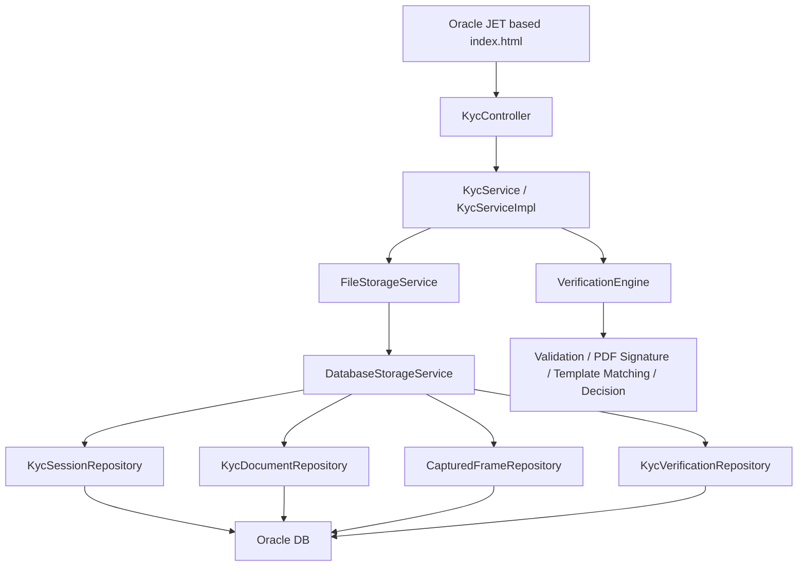
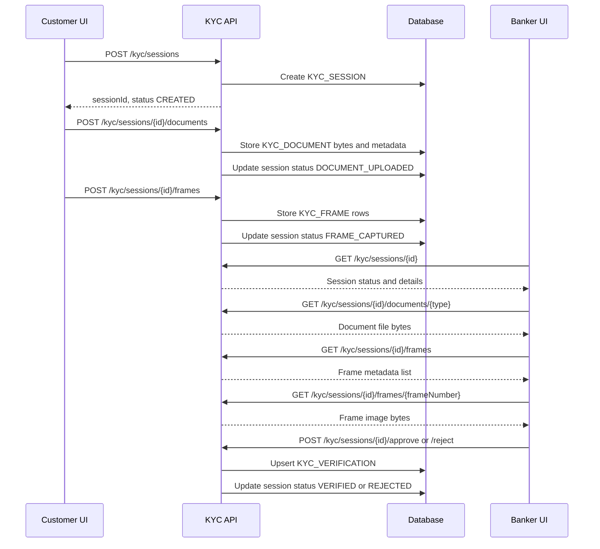
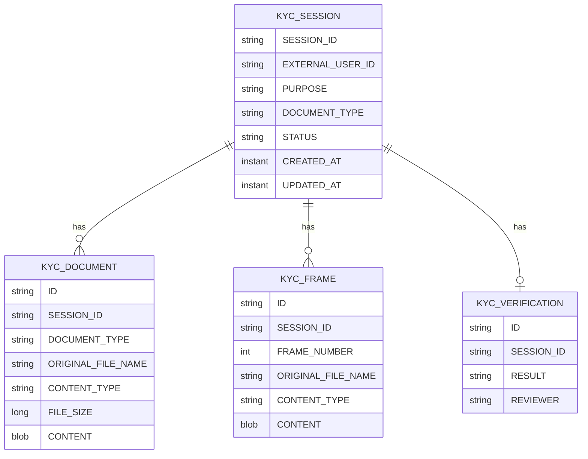

# KYC Service

Spring Boot service for creating KYC sessions, collecting customer identity documents and face frames, and allowing a banker/reviewer to approve or reject a session.

The app includes a browser UI at:

```text
http://localhost:8080/
```

The UI is Oracle JET based and has two workspaces:

- Customer view: create session, upload document, upload/capture frames, check result.
- Banker view: load a session, inspect document/frames, fetch result, approve or reject.

## Main Dependencies



## Runtime Configuration

Production/default profile uses Oracle:

```properties
spring.datasource.url=${KYC_DB_URL:jdbc:oracle:thin:@//localhost:1521/FREEPDB1}
spring.datasource.username=${KYC_DB_USERNAME:system}
spring.datasource.password=${KYC_DB_PASSWORD:}
```

Set these environment variables before running locally against Oracle:

```text
KYC_DB_URL
KYC_DB_USERNAME
KYC_DB_PASSWORD
```

Tests use H2 in-memory database through the `test` profile, so tests do not require Oracle.

## Data Flow



## API Functioning

### Create Session

```http
POST /kyc/sessions
Content-Type: application/json
```

Request:

```json
{
  "externalUserId": "HARSHUL001",
  "purpose": "ACCOUNT_OPENING",
  "documentType": "AADHAAR"
}
```

Creates a KYC session with status `CREATED`.

### Fetch Session

```http
GET /kyc/sessions/{sessionId}
```

Returns session ID, external user ID, purpose, document type, status, created time, and updated time.

### Upload Document

```http
POST /kyc/sessions/{sessionId}/documents
Content-Type: multipart/form-data
```

Form fields:

- `documentType`: one of `AADHAAR`, `PAN`, `PASSPORT`, `DRIVING_LICENSE`, `VOTER_ID`
- `file`: PDF file

Stores document bytes in `KYC_DOCUMENT` and moves the session to `DOCUMENT_UPLOADED`.

### Download Document

```http
GET /kyc/sessions/{sessionId}/documents/{documentType}
```

Returns the uploaded document bytes with `Content-Type` and `Content-Disposition` headers.

### Upload Frames

```http
POST /kyc/sessions/{sessionId}/frames
Content-Type: multipart/form-data
```

Form fields:

- `frames`: one or more image files

Stores captured frame bytes in `KYC_FRAME` and moves the session to `FRAME_CAPTURED`.

### List Frames

```http
GET /kyc/sessions/{sessionId}/frames
```

Returns frame metadata ordered by frame number.

### Download Frame

```http
GET /kyc/sessions/{sessionId}/frames/{frameNumber}
```

Returns the selected frame image bytes.

### Fetch Result

```http
GET /kyc/sessions/{sessionId}/result
```

Returns the saved verification decision for a session.

### Approve Session

```http
POST /kyc/sessions/{sessionId}/approve
Content-Type: application/json
```

Request:

```json
{
  "reviewerId": "reviewer-1",
  "reason": "manual-review",
  "remarks": "Checked manually"
}
```

Updates session status to `VERIFIED` and stores or updates the session result.

### Reject Session

```http
POST /kyc/sessions/{sessionId}/reject
Content-Type: application/json
```

Request:

```json
{
  "reviewerId": "reviewer-1",
  "reason": "document-mismatch",
  "remarks": "Document did not match customer."
}
```

Updates session status to `REJECTED` and stores or updates the session result.

## Entity Summary



## Local Validation

Run:

```text
mvnw test
```

Expected result:

```text
BUILD SUCCESS
```

## Current Design Notes

- The UI is a test and operations console, not a production customer portal.
- Documents and frames are stored in the database as binary content.
- Manual decisions upsert the verification result for a session.
- Automated verification engine classes exist, but the current controller flow is still manual-review oriented.

## Frontend workflow

The browser UI is intentionally split into separate workspaces:

- **New capture:** bankers enter only the customer account ID, create a verification, upload a PDF proof, and capture five camera frames. The technical session ID is managed invisibly by the browser.
- **Customer history:** bankers search by account ID and see the customer’s pending verification history.
- **Review queue:** reviewers search by account ID, select a pending verification, inspect/download the proof and frames, and approve or reject with a mandatory remark. The updated status is returned by the existing API and is visible to the banker on the next search.

### Frontend dependencies

The UI is a dependency-free HTML/CSS/JavaScript page served from `src/main/resources/static/index.html`.

- Browser Fetch API and `FormData` for API calls and multipart uploads.
- `navigator.mediaDevices.getUserMedia` for camera access.
- Canvas API for generating five JPEG face frames from the live camera stream.
- No npm install or frontend build step is required.

### How to interact

1. Start the Spring Boot service and open `http://localhost:8080/`.
2. In **New capture**, enter an account ID, choose the purpose and proof type, and select **Create verification**.
3. Upload the customer’s PDF proof, start the camera, and select **Capture 5 frames**. Camera access requires HTTPS or localhost.
4. In **Review queue**, enter the same account ID, choose a verification, download/check evidence, enter a remark, and approve or reject it.
5. Return to **Customer history** and search the account to confirm pending items and their current backend status.

The page uses the existing `/kyc` endpoints; no frontend-only mock data is required.

### Updated capture and reviewer behavior

- Reviewer operations are available at `/reviewer.html`; the banker page remains `/index.html`.
- Camera frames are held in the browser until the banker explicitly submits them.
- Exactly five frames are required. The submit action is disabled until five are ready and is locked after the first successful submission.
- A new five-frame submission replaces the previous frames for that session.
- Successful submission redirects to `/success.html`.
- Banker history uses `GET /kyc/customers/{accountId}/sessions` and can include approved, rejected, and pending sessions. The endpoint accepts an optional `documentType` query parameter.

## Future token-based integration

JWT integration is intentionally deferred for now. When the independent portal is ready, employee accounts, passwords, login, refresh tokens, and role administration should belong to that portal or identity service.

Configure the KYC service with:

    kyc.security.jwk-set-uri=https://identity.example.com/.well-known/jwks.json

The identity service must sign access tokens with an asymmetric key such as RS256, publish public keys through a JWKS endpoint, and include issuer, subject, audience, issued-at, expiry, and either a roles array or role claim.

Supported roles are BANKER, REVIEWER, and KYC_ADMIN. Send every request with `Authorization: Bearer <access-token>`.

BANKER can create sessions, upload evidence, and view account history. REVIEWER can inspect evidence and approve or reject. KYC_ADMIN has both capabilities. The KYC service does not store employee passwords.
