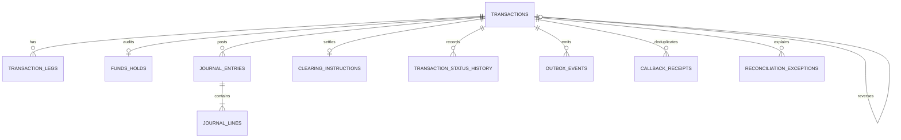

# MoneyBags Transaction Service

## Ownership and consistency boundary

Transaction Service owns business transactions, customer-facing legs, local hold audit records, double-entry journals, clearing work, status history, idempotency records, outbox events, callback receipts, configured limit rules, and reconciliation exceptions. Account Service remains authoritative for ledger balance, available balance, and atomic hold concurrency.



The full DDL, keys, checks, monetary precision, indexes, and configured RTGS rule are in `src/main/resources/db/migration/V1__transaction_domain.sql`.

## Processing timelines

Deposit and synchronous internal flows:

```text
REQUEST [sync]
 -> VALIDATION [sync]
 -> LIMIT CHECK [sync]
 -> ACCOUNT VALIDATION [sync]
 -> TRANSACTION + HISTORY [one local DB transaction]
 -> LEGS + BALANCED JOURNALS [same transaction]
 -> OUTBOX [same transaction]
 -> ACCOUNT SERVICE PROJECTION [async/retried/idempotent]
 -> HOLD CONSUMPTION, when applicable [async/idempotent]
 -> COMPLETED
```

External payment:

```text
REQUEST [sync]
 -> VALIDATION [sync]
 -> LIMIT CHECK [sync]
 -> ACCOUNT VALIDATION [sync]
 -> FUNDS HOLD [sync, atomic in Account Service]
 -> TRANSACTION + LEGS + PAYMENT JOURNAL + CLEARING + OUTBOX [local transaction]
 -> INITIAL ACCOUNT PROJECTION / HOLD CONSUMPTION [async]
 -> RAIL SETTLEMENT CALLBACK [async, provider-event idempotency]
 -> SETTLEMENT JOURNAL [callback transaction]
 -> COMPLETED
```

Cheque submission creates the transaction, destination leg, and clearing instruction only. Its customer credit journal and outbox event are created after a successful cheque-clearing callback.

Reversal preserves the original rows, moves the original to `REVERSAL_PENDING`, creates a linked transaction with opposite legs/journal lines/outbox instructions, and marks the original `REVERSED` only after compensating projections finish.

## Security contract

The current repository has no Security Service implementation or shared security library. The gateway-facing adapter therefore consumes trusted identity headers (`X-User-Id`, `X-Customer-Id`, `X-Employee-Id`, `X-Branch-Code`, `X-Permissions`, `X-Correlation-Id`). The production gateway must strip caller-supplied copies and inject verified claims. Domain services still enforce permissions, customer scope, maker/checker separation, and maker-only cancellation server-side.

## External contracts still required

`AccountClient` defines validation, atomic reserve/consume/release, and idempotent projection operations. `CardClient` is a narrow logical-reference validation contract because no Card Service implementation exists in this repository; it must be implemented by the future Card Service before the card-payment endpoint is deployable.
